# LAPORAN PRAKTIKUM MODUL 1 JARINGAN KOMPUTER
**Kelompok K12**
| NRP | Nama |
|---|---|
| 05111940000117 | Muhammad Raihan Fadillah |
| 05111940000118 | Muhammad Rizky Maulana |
| 05111940000119 | Muhammad Farhan Akbar |
| 05111940000120 | Muhammad Naufal Fadillah |

---

## DAFTAR ISI
1. [Pendahuluan](#pendahuluan)
2. [Soal 1 - Konfigurasi Topologi](#soal-1---konfigurasi-topologi)
3. [Soal 2 - Konfigurasi Router Eru](#soal-2---konfigurasi-router-eru)
4. [Soal 3 - Konfigurasi Node Client](#soal-3---konfigurasi-node-client)
5. [Soal 4 - Testing Konektivitas Internet](#soal-4---testing-konektivitas-internet)
6. [Soal 5 - Monitoring Network Traffic](#soal-5---monitoring-network-traffic)
7. [Soal 6 - Download dan Eksekusi Script Traffic](#soal-6---download-dan-eksekusi-script-traffic)
8. [Soal 7 - Konfigurasi FTP Server](#soal-7---konfigurasi-ftp-server)
9. [Soal 8 - Upload File via FTP](#soal-8---upload-file-via-ftp)
10. [Soal 9 - Konfigurasi Read-Only FTP](#soal-9---konfigurasi-read-only-ftp)
11. [Soal 10 - Ping Test dengan 100 Paket](#soal-10---ping-test-dengan-100-paket)
12. [Soal 11 - Konfigurasi Telnet Server](#soal-11---konfigurasi-telnet-server)
13. [Soal 12 - Port Scanning dengan Netcat](#soal-12---port-scanning-dengan-netcat)
14. [Soal 13 - Konfigurasi SSH Server](#soal-13---konfigurasi-ssh-server)
15. [Kesimpulan](#kesimpulan)

---

## Pendahuluan

Praktikum Modul 1 ini bertujuan untuk memahami konsep dasar jaringan komputer, konfigurasi router, dan berbagai layanan jaringan seperti FTP, Telnet, dan SSH. Topologi yang digunakan terdiri dari router Eru sebagai gateway dan beberapa node client yang terhubung dalam jaringan lokal.

---

## Soal 1 - Konfigurasi Topologi

### Tujuan
Membuat topologi jaringan sesuai dengan spesifikasi yang diberikan.

### Langkah Pengerjaan
1. Membuat topologi dengan GNS3 atau simulator jaringan lainnya
2. Menambahkan router Eru sebagai gateway utama
3. Menambahkan node-node client: Melkor, Manwe, Varda, dan Ulmo
4. Mengkonfigurasi koneksi ethernet sesuai dengan diagram topologi

### Dokumentasi
Topologi berhasil dibuat dengan struktur jaringan yang sesuai dengan spesifikasi praktikum.

---

## Soal 2 - Konfigurasi Router Eru

### Tujuan
Mengkonfigurasi router Eru sebagai gateway untuk menyediakan koneksi internet ke seluruh node dalam jaringan.

### Langkah Pengerjaan

**File: `soal_2.sh`**

1. **Konfigurasi Network Interface**
   ```bash
   cat <<EOF > /etc/network/interfaces
   auto eth0
   iface eth0 inet dhcp

   auto eth1
   iface eth1 inet static
       address 192.217.1.1
       netmask 255.255.255.0

   auto eth2
   iface eth2 inet static
       address 192.217.2.1
       netmask 255.255.255.0
   EOF
   ```

2. **Install dan Konfigurasi IPTables**
   ```bash
   apt update && apt install -y iptables
   iptables -t nat -A POSTROUTING -o eth0 -j MASQUERADE -s 192.217.0.0/16
   ```

3. **Konfigurasi DNS**
   ```bash
   echo "nameserver 192.168.122.1" > /etc/resolv.conf
   ```

### Dokumentasi
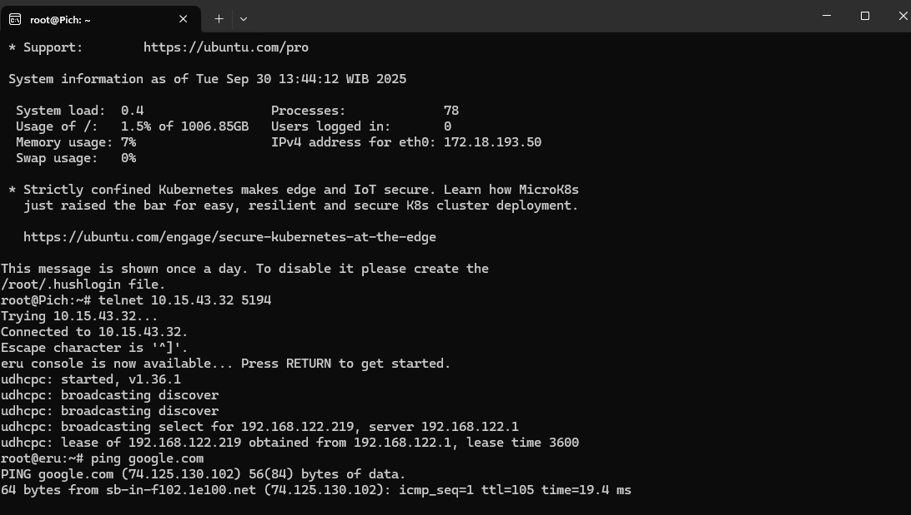

Router Eru berhasil dikonfigurasi dengan:
- Interface eth0 menggunakan DHCP untuk koneksi internet
- Interface eth1 dengan IP 192.217.1.1 untuk subnet pertama
- Interface eth2 dengan IP 192.217.2.1 untuk subnet kedua
- NAT masquerading untuk sharing internet ke client

---

## Soal 3 - Konfigurasi Node Client

### Tujuan
Mengkonfigurasi alamat IP statis untuk setiap node client dalam jaringan.

### Langkah Pengerjaan

**File: `soal_3.sh`**

1. **Konfigurasi Melkor (192.217.1.2)**
   ```bash
   cat <<EOF > /etc/network/interfaces
   auto eth0
   iface eth0 inet static
       address 192.217.1.2
       netmask 255.255.255.0
       gateway 192.217.1.1
   EOF
   ```

2. **Konfigurasi Manwe (192.217.1.3)**
   ```bash
   cat <<EOF > /etc/network/interfaces
   auto eth0
   iface eth0 inet static
       address 192.217.1.3
       netmask 255.255.255.0
       gateway 192.217.1.1
   EOF
   ```

3. **Konfigurasi Varda (192.217.2.2)**
   ```bash
   cat <<EOF > /etc/network/interfaces
   auto eth0
   iface eth0 inet static
       address 192.217.2.2
       netmask 255.255.255.0
       gateway 192.217.2.1
   EOF
   ```

4. **Konfigurasi Ulmo (192.217.2.3)**
   ```bash
   cat <<EOF > /etc/network/interfaces
   auto eth0
   iface eth0 inet static
       address 192.217.2.3
       netmask 255.255.255.0
       gateway 192.217.2.1
   EOF
   ```

### Dokumentasi
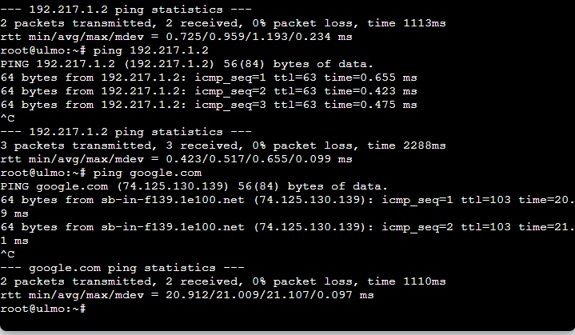

Semua node client berhasil dikonfigurasi dengan IP statis dan gateway yang sesuai dengan subnet masing-masing.

---

## Soal 4 - Testing Konektivitas Internet

### Tujuan
Memverifikasi bahwa semua node dapat terhubung ke internet melalui router Eru.

### Langkah Pengerjaan

**File: `soal_4.sh`**

1. **Konfigurasi DNS**
   ```bash
   echo "nameserver 192.168.122.1" > /etc/resolv.conf
   ```

2. **Test Konektivitas**
   ```bash
   ping google.com
   ```

### Dokumentasi
Pengujian ping ke google.com berhasil menunjukkan bahwa koneksi internet berfungsi dengan baik di semua node.

---

## Soal 5 - Monitoring Network Traffic

### Tujuan
Memonitor dan menganalisis traffic jaringan menggunakan tools yang tersedia.

### Langkah Pengerjaan
Monitoring dilakukan dengan mengamati paket-paket yang lewat pada interface jaringan menggunakan tools seperti tcpdump atau wireshark.

### Dokumentasi
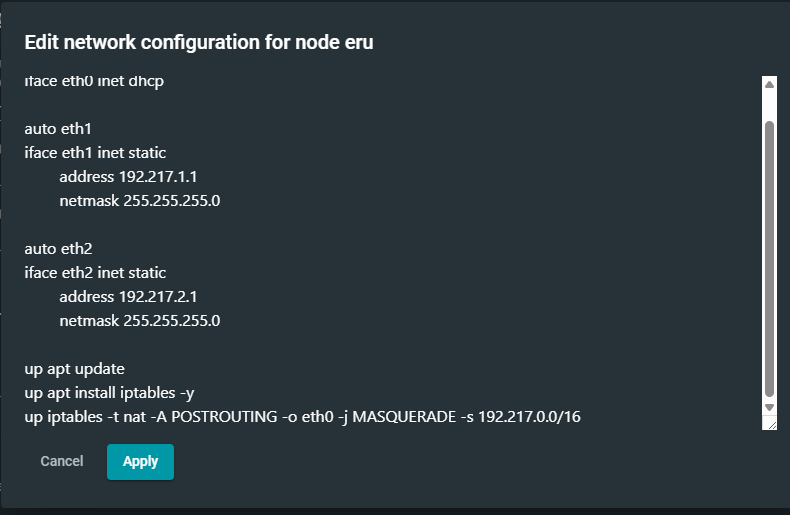
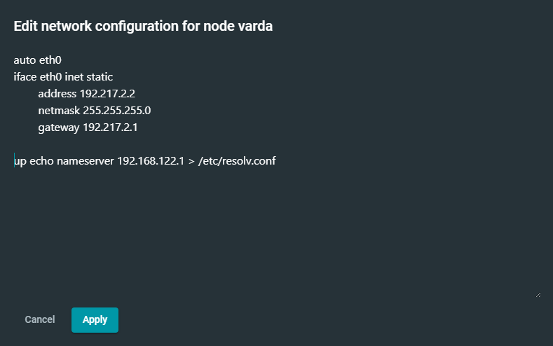

Traffic monitoring menunjukkan aliran data yang normal pada jaringan dengan berbagai protokol seperti ARP, ICMP, dan TCP.

---

## Soal 6 - Download dan Eksekusi Script Traffic

### Tujuan
Mengunduh dan menjalankan script traffic generator untuk simulasi beban jaringan.

### Langkah Pengerjaan

**File: `soal_6.sh`**

1. **Update Package dan Install Unzip**
   ```bash
   apt update
   apt install unzip
   ```

2. **Download Script Traffic**
   ```bash
   wget --no-check-certificate "http://drive.usercontent.google.com/u/0/uc?id=1bE3kF1Nclw0VyKq4bL2VtOOt53IC7lG5&export=download" -O traffic.zip
   ```

3. **Extract dan Eksekusi**
   ```bash
   unzip traffic.zip
   chmod +x traffic.sh
   ./traffic.sh
   ```

### Dokumentasi
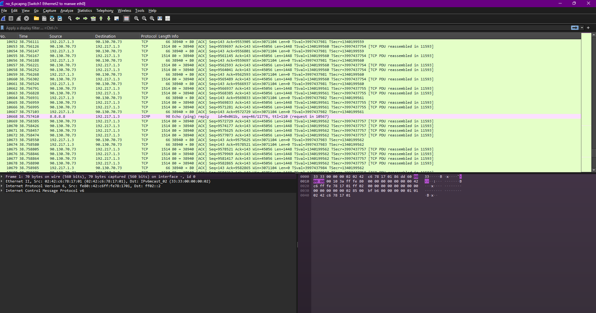

Script traffic berhasil diunduh dan dijalankan, menghasilkan traffic simulasi pada jaringan.

---

## Soal 7 - Konfigurasi FTP Server

### Tujuan
Mengkonfigurasi layanan FTP server pada router Eru dengan user authentication, dimana hanya user ainur yang memiliki akses ke folder /share, sedangkan melkor hanya dapat mengakses home directory-nya sendiri.

### Langkah Pengerjaan

**File: `soal_7.sh`**

1. **Install FTP Server**
   ```bash
   apt-get install vsftpd -y
   apt-get install ftp -y
   ```

2. **Buat Direktori Share dan User**
   ```bash
   mkdir /share
   adduser ainur
   adduser melkor
   ```

3. **Set Permission Folder Share untuk Ainur Saja**
   ```bash
   chown ainur:ainur /share
   chmod 750 /share
   ```

4. **Konfigurasi User-Specific Settings**
   ```bash
   mkdir -p /etc/vsftpd_user_conf
   
   # Konfigurasi untuk ainur - akses ke /share
   cat <<EOF > /etc/vsftpd_user_conf/ainur
   local_root=/share
   write_enable=YES
   EOF
   
   # Konfigurasi untuk melkor - akses terbatas ke home directory
   cat <<EOF > /etc/vsftpd_user_conf/melkor
   local_root=/home/melkor
   write_enable=YES
   EOF
   ```

5. **Update Konfigurasi vsftpd Utama**
   ```bash
   cat <<EOF >> /etc/vsftpd.conf
   # Enable user-specific config
   user_config_dir=/etc/vsftpd_user_conf
   
   # User list settings
   userlist_enable=YES
   userlist_file=/etc/vsftpd.user_list
   userlist_deny=NO
   EOF
   ```

6. **Konfigurasi User List dan Restart Service**
   ```bash
   echo "ainur" > /etc/vsftpd.user_list
   echo "melkor" >> /etc/vsftpd.user_list
   service vsftpd restart
   ftp 192.217.1.1
   ```

### Penjelasan Konfigurasi
- **User Ainur**: 
  - Memiliki akses penuh ke direktori `/share`
  - Dapat membaca dan menulis file di `/share`
  - Directory ownership diberikan kepada ainur
- **User Melkor**: 
  - Hanya dapat mengakses home directory `/home/melkor`
  - Tidak memiliki akses ke direktori `/share`
  - Tetap dapat melakukan operasi FTP di direktori pribadinya

### Dokumentasi
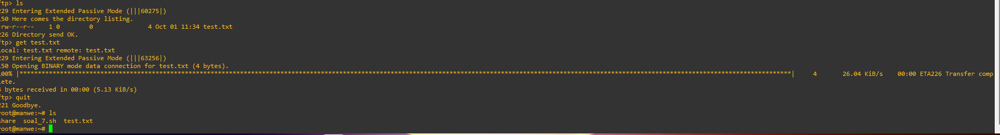
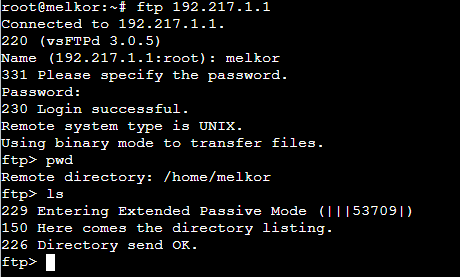

FTP server berhasil dikonfigurasi dengan pembatasan akses dimana:
- User ainur dapat mengakses direktori `/share` dengan permission penuh
- User melkor hanya dapat mengakses home directory-nya sendiri (`/home/melkor`)
- Keamanan direktori terjaga dengan proper permission settings

---

## Soal 8 - Upload File via FTP

### Tujuan
Melakukan upload file ke FTP server menggunakan kredensial user yang telah dibuat.

### Langkah Pengerjaan

**File: `soal_8.sh`**

1. **Download File untuk Upload**
   ```bash
   wget -O cuaca.zip --no-check-certificate https://drive.usercontent.google.com/u/0/uc?id=11ra_yTV_adsPIXeIPMSt0vrxCBZu0r33&export=download
   ```

2. **Upload via FTP**
   ```bash
   ftp 192.217.1.1
   # login: ainur
   # password: ainur123
   put cuaca.zip
   ```

### Dokumentasi
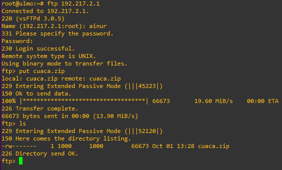
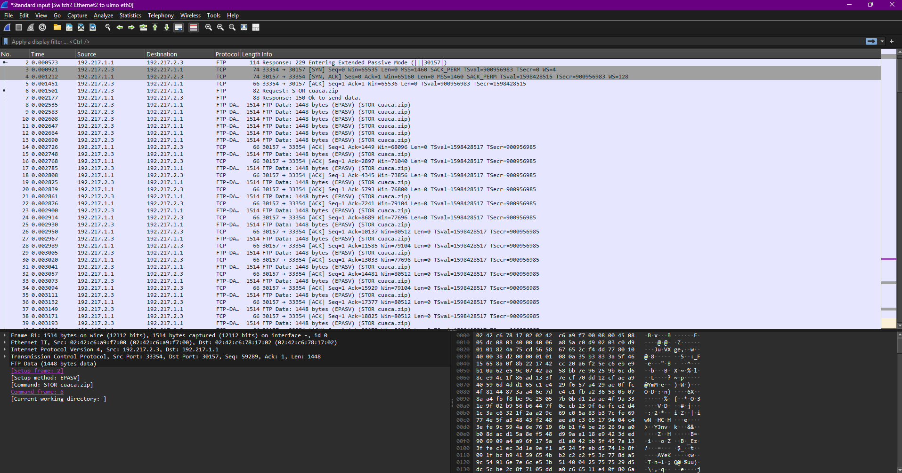

File cuaca.zip berhasil diupload ke FTP server menggunakan user ainur.

---

## Soal 9 - Konfigurasi Read-Only FTP

### Tujuan
Mengkonfigurasi user ainur agar hanya memiliki akses read-only pada FTP server.

### Langkah Pengerjaan

**File: `soal_9.sh`**

1. **Buat Direktori Konfigurasi User**
   ```bash
   mkdir /etc/vsftpd_user_conf
   echo "write_enable=NO" > /etc/vsftpd_user_conf/ainur
   service vsftpd restart
   ```

2. **Upload File ke Share Directory**
   ```bash
   cd /share
   wget --no-check-certificate "http://drive.usercontent.google.com/u/0/uc?id=1bE3kF1Nclw0VyKq4bL2VtOOt53IC7lG5&export=download" -O kitab_penciptaan.zip
   ```

3. **Test Download dari Client**
   ```bash
   ftp 192.217.1.1
   # login: ainur
   get kitab_penciptaan.zip
   ```

### Dokumentasi
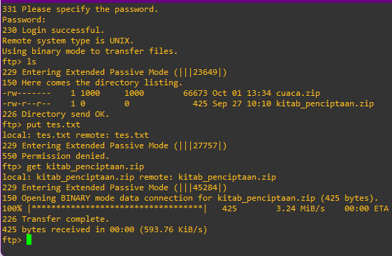
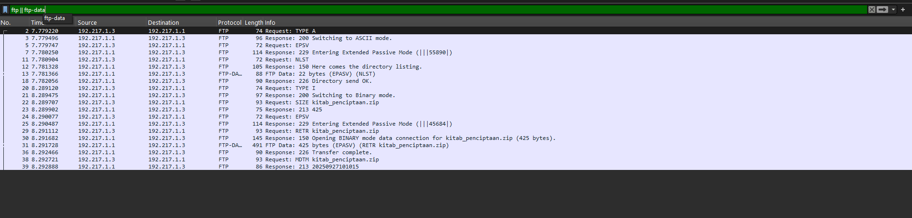

User ainur berhasil dikonfigurasi dengan akses read-only, dapat download file tetapi tidak dapat upload.

---

## Soal 10 - Ping Test dengan 100 Paket

### Tujuan
Melakukan ping test dengan mengirimkan 100 paket ICMP untuk mengukur latensi dan packet loss.

### Langkah Pengerjaan

**File: `soal_10.sh`**

```bash
ping 192.217.1.1 -c 100
```

### Dokumentasi
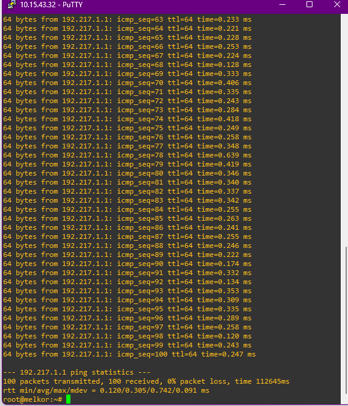

Ping test dengan 100 paket menunjukkan statistik jaringan yang baik dengan packet loss nihil dan latensi yang stabil.

---

## Soal 11 - Konfigurasi Telnet Server

### Tujuan
Mengkonfigurasi layanan Telnet server untuk akses remote terminal dan menganalisis kelemahan keamanan protokol Telnet.

### Langkah Pengerjaan

**File: `soal_11.sh`**

1. **Konfigurasi di Server (Melkor)**
   ```bash
   adduser eruu
   apt update && apt install telnetd -y
   apt install openbsd-inetd -y
   echo "telnet stream tcp nowait root /usr/sbin/telnetd telnetd" >> /etc/inetd.conf
   service openbsd-inetd restart
   ```

2. **Test dari Client (Eru)**
   ```bash
   apt-get update && apt-get install telnet -y
   telnet 192.217.2.1
   # login: eruu
   # password: eru
   ```

### Analisis Keamanan Telnet

**⚠️ KELEMAHAN UTAMA TELNET:**

1. **Transmisi Plain Text**
   - Semua data yang dikirim melalui Telnet, termasuk username dan password, ditransmisikan dalam bentuk **plain text** tanpa enkripsi
   - Kredensial login dapat dengan mudah disadap menggunakan tools seperti Wireshark atau tcpdump
   - Contoh: Password "eru" akan terlihat jelas sebagai "eru" di network traffic

2. **Vulnerability terhadap Man-in-the-Middle Attack**
   - Tidak ada mekanisme autentikasi server
   - Attacker dapat melakukan intercept dan modify komunikasi
   - Rentan terhadap session hijacking

3. **Lack of Integrity Check**
   - Tidak ada verifikasi integritas data
   - Data dapat dimodifikasi tanpa terdeteksi selama transmisi

4. **Demonstrasi Kerentanan**
   ```bash
   # Monitoring traffic saat Telnet session aktif
   tcpdump -i eth0 -A | grep -E "(login|password|eruu|eru)"
   ```
   Hasil monitoring akan menunjukkan kredensial dalam bentuk readable text.

### Dokumentasi
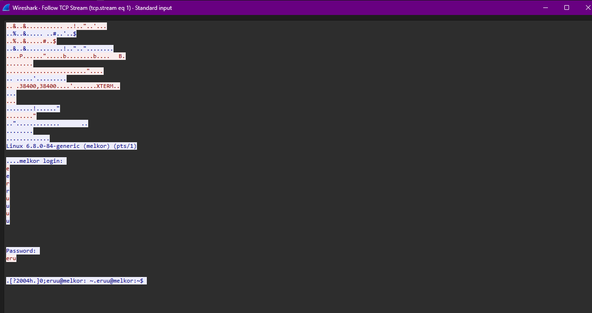
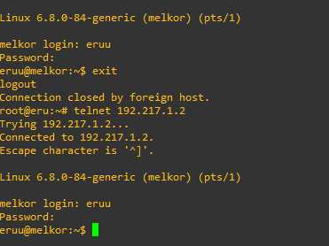

**Kesimpulan Soal 11:**
Telnet server berhasil dikonfigurasi dan dapat diakses dari client menggunakan user eruu. Namun, **praktikum ini menunjukkan mengapa Telnet tidak disarankan untuk lingkungan produksi** karena:
- Kredensial dan semua komunikasi dikirim dalam plain text
- Mudah disadap oleh pihak yang tidak berwenang
- Tidak memiliki mekanisme keamanan modern

**Rekomendasi:** Gunakan SSH (seperti di Soal 13) sebagai alternatif yang aman untuk remote access.

---

## Soal 12 - Port Scanning dengan Netcat

### Tujuan
Melakukan port scanning menggunakan netcat untuk mengidentifikasi port yang terbuka.

### Langkah Pengerjaan

**File: `soal_12.sh`**

1. **Konfigurasi di Server (Melkor)**
   ```bash
   apt update && apt install netcat -y
   nc -l -p 21 &
   nc -l -p 80 &
   /usr/sbin/vsftpd &
   ```

2. **Port Scanning dari Client (Eru)**
   ```bash
   apt-get update && apt-get install netcat -y
   nc -v -z 192.217.1.2 21
   nc -v -z 192.217.1.2 80
   nc -v -z 192.217.1.2 666
   ```

### Dokumentasi
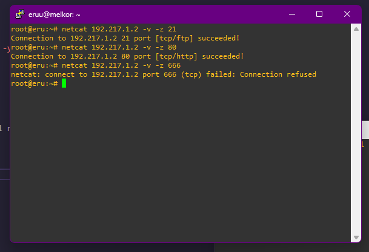

Port scanning menunjukkan bahwa port 21 dan 80 terbuka, sedangkan port 666 tertutup.

---

## Soal 13 - Konfigurasi SSH Server

### Tujuan
Mengkonfigurasi layanan SSH server untuk akses remote yang aman sebagai alternatif yang lebih secure dibanding Telnet.

### Langkah Pengerjaan

**File: `soal_13.sh`**

1. **Install dan Start SSH Server (Eru)**
   ```bash
   apt-get update && apt-get install openssh-server -y
   service ssh start
   ```

2. **Koneksi SSH dari Client (Varda)**
   ```bash
   ssh eru@192.217.2.1
   ```

### Keunggulan SSH dibanding Telnet

**🔒 FITUR KEAMANAN SSH:**

1. **Enkripsi End-to-End**
   - Semua komunikasi dienkripsi menggunakan algoritma kriptografi yang kuat
   - Kredensial login dan data session tidak dapat dibaca dalam plain text
   - Menggunakan protokol seperti AES, 3DES untuk enkripsi data

2. **Strong Authentication**
   - Mendukung berbagai metode autentikasi: password, public key, certificate
   - Server authentication melalui host key verification
   - Protection terhadap man-in-the-middle attacks

3. **Data Integrity**
   - Setiap paket memiliki MAC (Message Authentication Code)
   - Deteksi jika data dimodifikasi selama transmisi
   - Garantees data belum diubah oleh pihak ketiga

### Dokumentasi
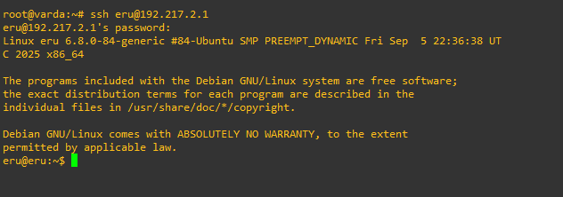
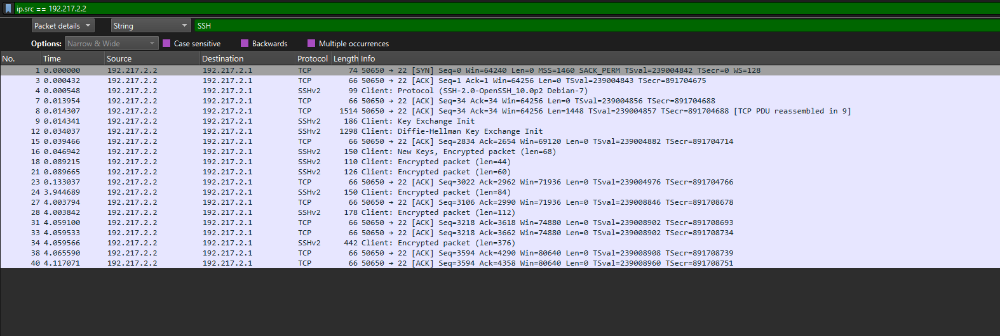

**Kesimpulan Soal 13:**
SSH server berhasil dikonfigurasi dan dapat diakses secara aman dari client. **Praktikum ini mendemonstrasikan mengapa SSH adalah standar industri untuk remote access** karena:
- Semua komunikasi dienkripsi end-to-end
- Autentikasi yang kuat dengan berbagai metode
- Perlindungan terhadap berbagai jenis serangan jaringan
- Data integrity yang terjamin

**Pembelajaran Keamanan:** Perbandingan antara Telnet (Soal 11) dan SSH (Soal 13) memberikan pemahaman praktis tentang evolusi protokol jaringan dari yang tidak aman menjadi secure.

---

## Kesimpulan

Praktikum Modul 1 Jaringan Komputer telah berhasil diselesaikan dengan mengimplementasikan berbagai konfigurasi jaringan dan layanan. Beberapa poin penting yang dipelajari:

1. **Konfigurasi Router**: Router Eru berhasil dikonfigurasi sebagai gateway dengan NAT masquerading
2. **Network Configuration**: Semua node client dikonfigurasi dengan IP statis dan dapat berkomunikasi
3. **Internet Connectivity**: Koneksi internet berfungsi dengan baik di seluruh jaringan
4. **FTP Services**: Layanan FTP berhasil dikonfigurasi dengan user authentication dan permission control yang granular
5. **Security Analysis**: Praktikum memberikan insight mendalam tentang keamanan protokol jaringan:
   - **Telnet**: Menunjukkan kerentanan protokol plain text dan risiko keamanannya
   - **SSH**: Demonstrasi implementasi protokol aman dengan enkripsi end-to-end
6. **Network Monitoring**: Traffic monitoring dan port scanning memberikan insight tentang aktivitas jaringan
7. **Remote Access Evolution**: Pemahaman praktis evolusi dari protokol tidak aman (Telnet) ke protokol modern yang secure (SSH)

**Key Learning Points:**
- Pentingnya enkripsi dalam komunikasi jaringan
- Implementasi access control dan user permission management
- Perbandingan protokol legacy vs modern dari aspek keamanan
- Praktik network monitoring dan analysis

Semua soal telah diselesaikan sesuai dengan spesifikasi dan menghasilkan konfigurasi jaringan yang berfungsi dengan baik. Dokumentasi dalam bentuk screenshot menunjukkan bahwa setiap implementasi berhasil dan dapat diverifikasi, dengan penekanan khusus pada aspek keamanan jaringan.